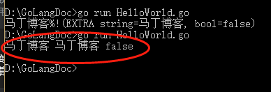
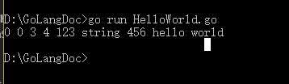
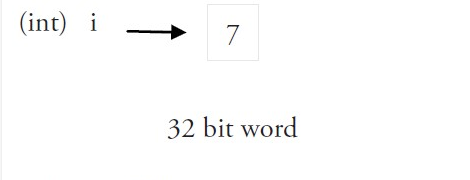
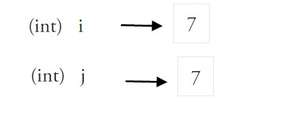

## Go语言变量

变量来源于数学，是计算机语言中能储存计算结果或能表示值抽象概念。变量可以通过变量名访问。

Go 语言变量名由字母、数字、下划线组成，其中首个字母不能为数字。
<!--more-->
声明变量的一般形式是使用 var 关键字：

```go
var name type
```

### 变量声明

1. 指定变量类型，声明后若不赋值，使用默认值。

```go
var g_name g_type
```

1. 根据值自行判定变量类型

```go
var g_name=""
```

1. 省略var, 注意 :=左侧的变量不应该是已经声明过的，否则会导致编译错误。

```go
g_name := value

// 例如
var a int = 10
var b = 10
c := 10
```

实例如下：

```go
package main

import "fmt"

func main() {
		var one="马丁博客"
		var two string="马丁博客"
		var three bool
    fmt.Println(one,two,three)
}
```

输出为：



### 多变量声明

```go
var a,b,c=1,2,3
q,w,e:="4","5","6"	//出现在:=左侧的变量不应该是已经被声明过的，否则会导致编译错误

// 这种因式分解关键字的写法一般用于声明全局变量
var (
    vname1 v_type1
    vname2 v_type2
)
```

实例如下：

```go
package main

var x,y int
var (	// 因式分解关键字的写法一般用于声明全局变量
    m int
    k bool
)

var a,b int=3,4
var d,f=123,"string"

//这种不带声明格式的只能在函数体中出现
//g, h := 123, "hello"

func main(){
    g,h:=456,"hello world"
    println(x,y,a,b,d,f,g,h)
}
```

执行以上代码返回：



## 值类型和引用类型

所有像int、float、bool、和string这些基本类型都属于值类型，使用这些类型的变量直接指向存在内存中的值



当使用等号 `=` 将一个变量的值赋值给另一个变量时，如：`j = i`，实际上是在内存中将 i 的值进行了拷贝：



引用类型的变量 r1 存储的是 r1 的值所在的内存地址（数字），或内存地址中第一个字所在的位置


这个内存地址为称之为指针，这个指针实际上也被存在另外的某一个字中。

同一个引用类型的指针指向的多个字节可以是在连续的内存地址中（内存布局是连续的），这也是计算效率最高的一种存储形式；也可以将这些字分散存放在内存中，每个字都指示了下一个字所在的内存地址。

当使用赋值语句 r2 = r1 时，只有引用（地址）被复制。

如果 r1 的值被改变了，那么这个值的所有引用都会指向被修改后的内容，在这个例子中，r2 也会受到影响。

## 注意事项：

- 如果你声明了一个局部变量却没有在相同的代码块中使用它，会得到编译错误，例如下面这个例子当中的变量 a：

```go
package main

import "fmt"

func main() {
   var a string = "abc"
   fmt.Println("hello, world")
}
```

- 全局变量是允许声明但不使用