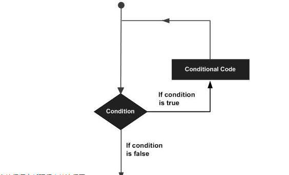
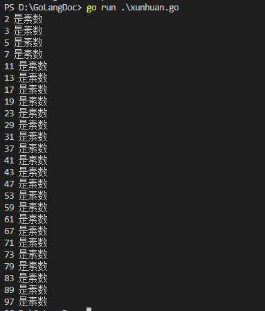
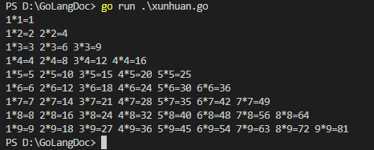

## Go 语言循环语句

在不少实际问题中有许多具有规律性的重复操作，因此在程序中就需要重复执行某些语句



Go 语言提供了以下几种类型循环处理语句：<!--more-->

| 循环类型                                                  | 描述                                 |
| --------------------------------------------------------- | ------------------------------------ |
| [for 循环](http://www.runoob.com/go/go-for-loop.html)     | 重复执行语句块                       |
| [循环嵌套](http://www.runoob.com/go/go-nested-loops.html) | 在 for 循环中嵌套一个或多个 for 循环 |

循环控制语句可以控制循环体内语句的执行过程。

GO 语言支持以下几种循环控制语句：

| 控制语句                                                     | 描述                                             |
| ------------------------------------------------------------ | ------------------------------------------------ |
| [break 语句](http://www.runoob.com/go/go-break-statement.html) | 经常用于中断当前 for 循环或跳出 switch 语句      |
| [continue 语句](http://www.runoob.com/go/go-continue-statement.html) | 跳过当前循环的剩余语句，然后继续进行下一轮循环。 |
| [goto 语句](http://www.runoob.com/go/go-goto-statement.html) | 将控制转移到被标记的语句。                       |

如过循环中条件语句永远不为 false 则会进行无限循环，我们可以通过 for 循环语句中只设置一个条件表达式来执行无限循环：

```go
package main

import "fmt"

func main() {
    for true  {
        fmt.Printf("这是无限循环。\n");
    }
}
```

## 编程小练习1：输出1-100素数

```go
package main 

import "fmt"
func main()  {
	var m,k int //声明变量

	m=1	/*这里不写入FOR循环是因为For语句执行之初会将a的值变为1，当我们goto A时for语句会重新执行（不是重新一轮循环）*/

	A:for m<100{
		m++
		for k=2;k<m;k++{
			if m%k==0{
				goto A
			}
		}
		fmt.Println(k,"是素数")
	}
}
```

执行以上代码返回结果：



## 编程小练习2：99乘法表

```go
package main 

import "fmt"
func main()  {
	for i:=1;i<=9;i++{	//i控制行，以及计算的最大值
		for j:=1;j<=i;j++{
			fmt.Printf("%d*%d=%d ",j,i,i*j)
		}
		fmt.Println("")
	}
}
```

执行以上代码返回：



